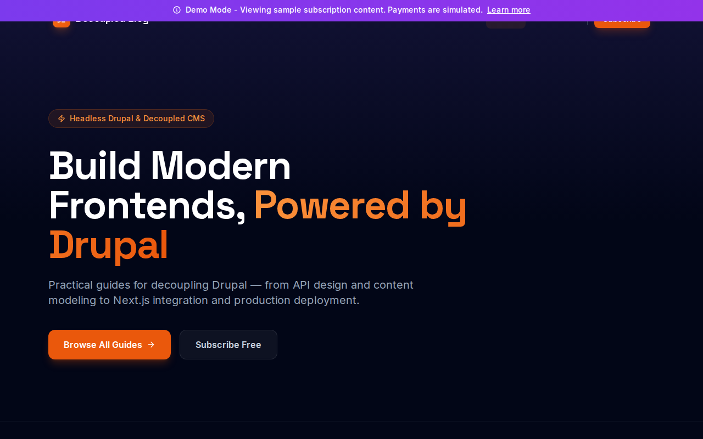

# Decoupled Blog

A headless Drupal blog built with Next.js, Tailwind CSS, and Stripe for optional subscription paywalls. Features a dark editorial design with an indigo + orange color scheme.



## Features

- **Headless Drupal Backend**: Content managed via Decoupled.io with GraphQL API
- **Subscription Paywall**: Free users see excerpts, subscribers see full content via Stripe
- **Dark Editorial Theme**: Modern dark UI with indigo/orange accent colors, Space Grotesk + Inter typography
- **Post Tags & Author Avatars**: Rich post cards with tag pills, author photos, and read time
- **Demo Mode**: Fully functional preview with mock data — no backend required
- **TypeScript**: Fully typed with strict TypeScript

## Quick Start

### 1. Install & Setup

```bash
npm install
npm run setup
```

The interactive setup script guides you through creating a Drupal space and configuring Stripe.

### 2. Start Development Server

```bash
npm run dev
```

Open [http://localhost:3000](http://localhost:3000) to see your site.

### Demo Mode

To run without any backend:

```bash
NEXT_PUBLIC_DEMO_MODE=true npm run dev
```

## Environment Variables

| Variable | Description | Required |
|----------|-------------|----------|
| `DRUPAL_BASE_URL` | Your Drupal space URL | Yes |
| `DRUPAL_CLIENT_ID` | OAuth client ID | Yes |
| `DRUPAL_CLIENT_SECRET` | OAuth client secret | Yes |
| `STRIPE_SECRET_KEY` | Stripe secret key | For subscriptions |
| `NEXT_PUBLIC_STRIPE_PUBLISHABLE_KEY` | Stripe publishable key | For subscriptions |
| `STRIPE_PRICE_ID` | Price ID for subscription | For subscriptions |
| `STRIPE_WEBHOOK_SECRET` | Webhook signing secret | For webhooks |
| `NEXT_PUBLIC_DEMO_MODE` | Enable demo mode (`true`) | Optional |

## Project Structure

```
decoupled-blog/
├── app/
│   ├── api/
│   │   ├── checkout/          # Stripe checkout session
│   │   ├── graphql/           # Drupal GraphQL proxy
│   │   ├── portal/            # Stripe customer portal
│   │   ├── subscription/      # Subscription verification
│   │   └── webhooks/stripe/   # Stripe webhook handler
│   ├── components/
│   │   ├── Header.tsx         # Scroll-aware nav with logo
│   │   ├── Footer.tsx         # Blog footer
│   │   ├── PostCard.tsx       # Post cards with tags & authors
│   │   ├── Paywall.tsx        # Subscription paywall
│   │   ├── HeroSection.tsx    # Homepage hero
│   │   ├── CTASection.tsx     # Newsletter CTA
│   │   └── HomepageRenderer.tsx
│   ├── posts/
│   │   ├── page.tsx           # All posts listing
│   │   └── [slug]/page.tsx    # Individual post pages
│   └── [...slug]/page.tsx     # Dynamic routing
├── lib/
│   ├── apollo-client.ts       # GraphQL client
│   ├── queries.ts             # GraphQL queries + transformPost
│   ├── demo-mode.ts           # Mock data for demo mode
│   ├── stripe.ts              # Stripe client
│   ├── subscription.ts        # Subscription helpers
│   └── types.ts               # TypeScript types
├── data/
│   └── mock/                  # Demo mode mock data
└── scripts/
    └── setup.ts               # Interactive setup wizard
```

## Stripe Configuration

1. Get API keys from [Stripe Dashboard](https://dashboard.stripe.com/apikeys)
2. Create a product with a recurring price in [Products](https://dashboard.stripe.com/products)
3. Add keys to `.env.local`:
   ```
   STRIPE_SECRET_KEY=sk_test_...
   NEXT_PUBLIC_STRIPE_PUBLISHABLE_KEY=pk_test_...
   STRIPE_PRICE_ID=price_...
   ```

### Testing Webhooks Locally

```bash
npm run stripe:listen
```

Use test card `4242 4242 4242 4242` for checkout testing.

## Commands

| Command | Description |
|---------|-------------|
| `npm run dev` | Start development server |
| `npm run build` | Build for production |
| `npm run setup` | Interactive setup wizard |
| `npm run setup-content` | Import sample content |
| `npm run stripe:listen` | Forward Stripe webhooks locally |

## Removing Demo Mode

To convert to a production app:

1. Delete `lib/demo-mode.ts` and `data/mock/`
2. Delete `app/components/DemoModeBanner.tsx`
3. Remove `DemoModeBanner` from `app/layout.tsx`
4. Remove demo mode checks from `app/page.tsx` and `app/posts/page.tsx`

## Deployment

1. Push to GitHub
2. Import in Vercel
3. Add environment variables
4. Deploy

Set `NEXT_PUBLIC_DEMO_MODE=true` for a demo deployment without backends.

## License

MIT
